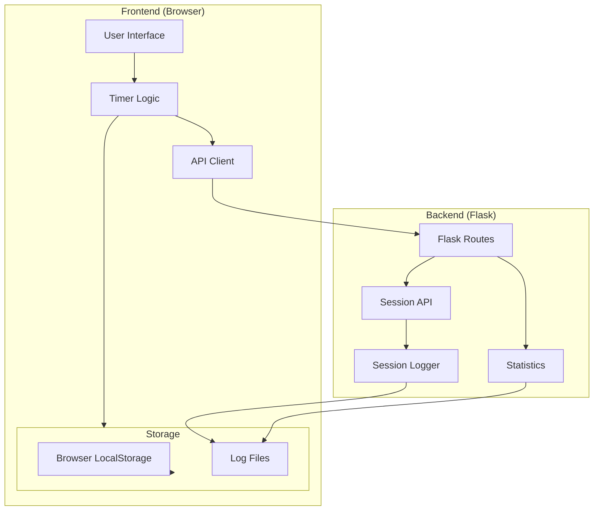
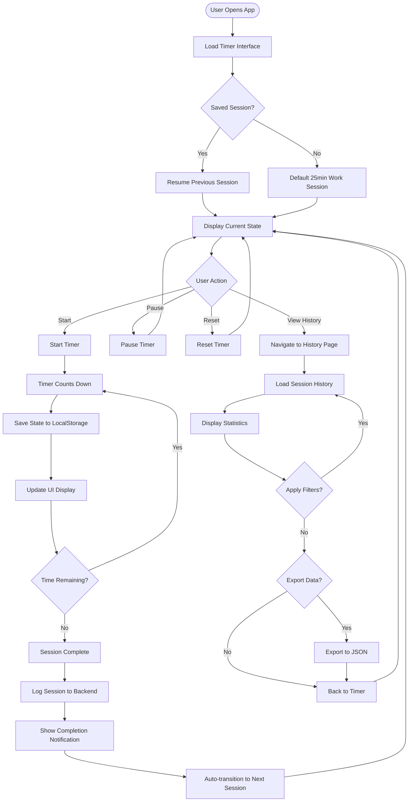
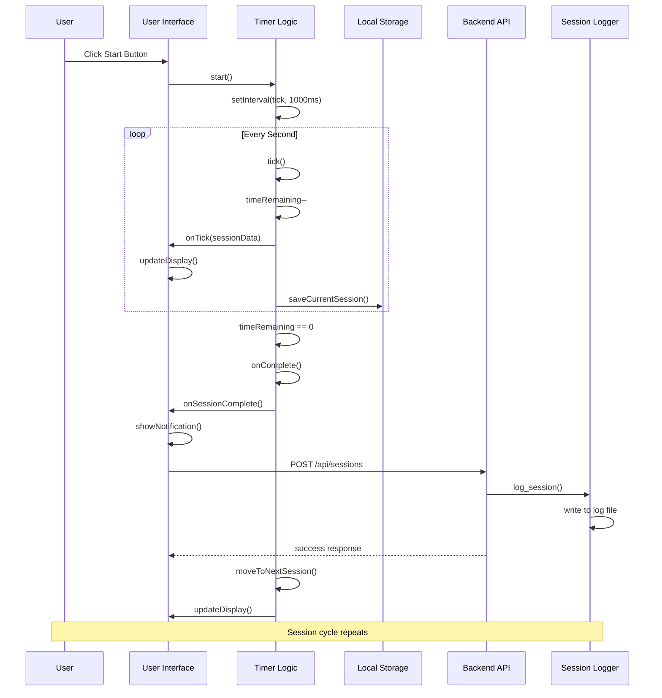
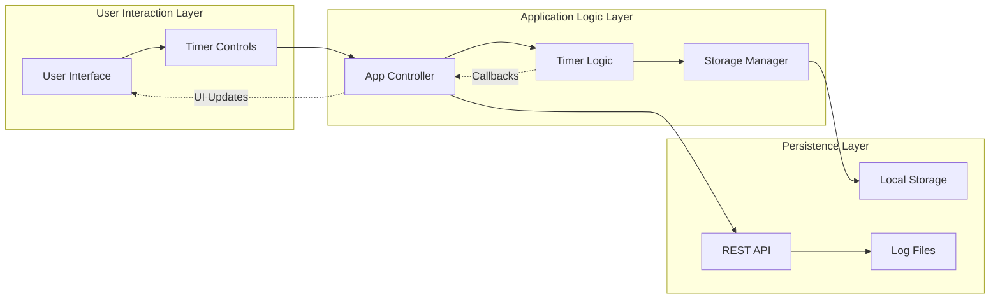
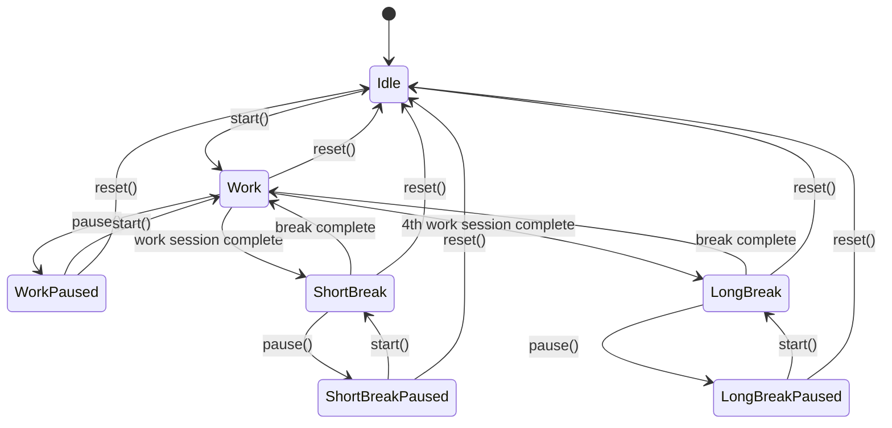

# Pomodoro Timer Application Documentation

## Overview

The Pomodoro Timer is a web-based application that implements the Pomodoro Technique for productivity management. It features a frontend-first architecture with JavaScript handling all timer logic while Flask serves as a lightweight backend for session persistence and static content delivery.

## Architecture Overview



## User Flow Diagram



## Sequence Diagram: Timer Session Flow



## Component Interactions

### Frontend Components

#### 1. PomodoroTimer Class (`timer.js`)
- **Purpose**: Core timer logic and state management
- **Key Methods**:
  - `start()`: Begin countdown
  - `pause()`: Stop countdown
  - `reset()`: Reset to session start
  - `tick()`: Called every second
  - `onComplete()`: Handle session completion

#### 2. PomodoroApp Class (`app.js`)
- **Purpose**: UI controller and event coordination
- **Key Methods**:
  - `init()`: Initialize application
  - `bindEvents()`: Attach event listeners
  - `updateDisplay()`: Update UI elements
  - `handleSessionComplete()`: Process session completion

#### 3. TimerStorage Class (`storage.js`)
- **Purpose**: Browser local storage management
- **Key Methods**:
  - `saveCurrentSession()`: Persist session state
  - `loadCurrentSession()`: Restore session state
  - `saveSettings()`: Store user preferences

### Backend Components

#### 1. Flask Application (`app.py`)
- **Routes**:
  - `GET /`: Main timer interface
  - `GET /history`: Session history page
  - `POST /api/sessions`: Log session data
  - `GET /api/sessions`: Retrieve session history
  - `GET /api/stats`: Get statistics

#### 2. Session Management (`utils/session_manager.py`)
- **PomodoroSession Class**: Data model for sessions
- **Validation Functions**: Ensure data integrity

#### 3. Session Logger (`utils/logger.py`)
- **SessionLogger Class**: File-based session persistence
- **Log Management**: Reading, writing, and rotating log files

## Data Flow Architecture



## Session State Management

### Local Storage Structure
```javascript
{
  "currentSession": {
    "type": "work|short_break|long_break",
    "timeRemaining": 1500, // seconds
    "isRunning": false,
    "cycleCount": 2
  },
  "settings": {
    "workDuration": 25,
    "shortBreakDuration": 5,
    "longBreakDuration": 15,
    "soundEnabled": true
  }
}
```

### Backend Session Format
```json
{
  "session_id": "uuid",
  "session_type": "work",
  "duration_minutes": 25,
  "task_description": "Working on documentation",
  "start_time": "2025-11-28T10:00:00Z",
  "end_time": "2025-11-28T10:25:00Z",
  "completed": true,
  "interruptions": 0
}
```

## API Endpoints Documentation

### Session Management

#### Create Session
```
POST /api/sessions
Content-Type: application/json

{
  "session_type": "work",
  "duration_minutes": 25,
  "task_description": "Working on project",
  "completed": true,
  "interruptions": 0
}
```

#### Get Sessions
```
GET /api/sessions?limit=100&date=2025-11-28

Response:
{
  "sessions": [...],
  "total": 42
}
```

#### Get Statistics
```
GET /api/stats

Response:
{
  "total_sessions": 150,
  "completed_sessions": 135,
  "total_focus_minutes": 3375,
  "completion_rate": 90.0,
  "today_sessions": 8
}
```

## Timer Logic Flow



## Error Handling Strategy

### Frontend Error Handling
1. **Timer Failures**: Graceful degradation with user notifications
2. **Storage Failures**: Fallback to in-memory state
3. **API Failures**: Local-only mode with retry mechanisms
4. **Validation Errors**: User-friendly error messages

### Backend Error Handling
1. **File I/O Errors**: Logging with fallback mechanisms
2. **Validation Errors**: HTTP 400 responses with details
3. **Server Errors**: HTTP 500 responses with generic messages
4. **Resource Limits**: Automatic log rotation and cleanup

## Performance Considerations

### Frontend Optimizations
- **Timer Precision**: Uses `setInterval` with 1-second intervals
- **State Persistence**: Debounced localStorage writes
- **DOM Updates**: Minimal DOM manipulation during countdown
- **Memory Management**: Proper interval cleanup

### Backend Optimizations
- **File I/O**: Append-only log writes for performance
- **Session Queries**: Limited result sets with pagination
- **Static Assets**: Efficient Flask static file serving
- **Resource Usage**: Minimal memory footprint

## Security Considerations

### Input Validation
- All user inputs sanitized before storage
- Session data validated against schemas
- File paths validated to prevent directory traversal

### Data Protection
- No sensitive data stored in browser
- Session logs contain only productivity metrics
- No user authentication required (local use)

## Testing Strategy

### Frontend Testing
- **Unit Tests**: Timer logic and utility functions
- **Integration Tests**: Component interactions
- **Browser Tests**: Cross-browser compatibility

### Backend Testing
- **Unit Tests**: Session models and utilities
- **API Tests**: Endpoint functionality
- **Integration Tests**: Full workflow validation

## Deployment Considerations

### Development Setup
```bash
uv venv
uv pip install -r requirements.txt
uv run python app.py
```

### Production Recommendations
- Use WSGI server (Gunicorn, uWSGI)
- Configure proper logging levels
- Set up log rotation for session files
- Consider database backend for scaling

## Browser Compatibility

### Supported Features
- **JavaScript ES6+**: Class syntax, arrow functions
- **CSS Custom Properties**: Theme support
- **Local Storage**: Session persistence
- **Fetch API**: Backend communication

### Fallback Support
- Graceful degradation for older browsers
- Progressive enhancement approach
- Basic functionality without JavaScript

This documentation provides a comprehensive overview of the Pomodoro Timer application's architecture, data flow, and operational characteristics, enabling developers to understand and extend the system effectively.